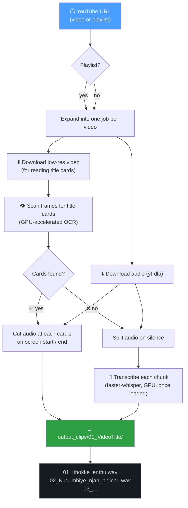

<div align="center">

# 🎬 YouTube Dialogue Clipper

**Point it at a YouTube video or playlist → get back a folder of perfectly-named, perfectly-cut dialogue clips.**

No manual scrubbing. No renaming 200 files by hand. No guessing where one line ends and the next begins.

[](https://www.python.org/)
[](#-gpu-acceleration)
[](#-installation)
[](https://github.com/yt-dlp/yt-dlp)

</div>

---

## 🤔 The problem

Channels like "Top 10 Malayalam Troll Dialogues" pack ten quotable lines into one video. If you want each line as its own audio file — named sensibly, not `clip_04.wav` — you're stuck scrubbing the timeline by hand, over and over, for every video in the playlist.

## ✨ The idea

This script does that scrubbing for you, two different ways depending on what the video gives it to work with:

<table>
<tr>
<td width="50%" valign="top">

### 🃏 Plan A — Read the title cards
Many of these videos flash a card like this between dialogues:

```
┌─────────────────────┐
│          3           │
│                       │
│   Ithokke enthu....   │
└─────────────────────┘
```

The script **watches for these cards with OCR**, reads the number and the name straight off the screen, and cuts the clip at the exact moment each card appears and disappears.

**Result:** `03_Ithokke_enthu.wav` — the *actual* dialogue name, frame-accurate.

</td>
<td width="50%" valign="top">

### 🎙️ Plan B — Listen instead
No title cards? No problem. The script splits the audio on natural pauses in speech, then **transcribes each clip on the GPU** with `faster-whisper` and names the file after the first few spoken words.

**Result:** `dialogue_007.wav` → `Enikkini_oru_makan_koodi.wav`

</td>
</tr>
</table>

Every video in a playlist is checked independently and gets its own numbered folder — mix title-card videos and plain-dialogue videos in the same playlist and it Just Works™.

---

## 🗺️ How a video flows through the pipeline



---

## 🚀 Quickstart

```powershell
# 1. Install FFmpeg and Deno (yt-dlp needs a JS runtime for YouTube)
winget install Gyan.FFmpeg
winget install DenoLand.Deno

# 2. Install Python dependencies
pip install -r requirements.txt

# 3. faster-whisper drags in a CPU-only onnxruntime that shadows the GPU one — swap it:
pip uninstall -y onnxruntime
pip install --force-reinstall --no-deps onnxruntime-gpu

# 4. Run it
python src/main.py "https://youtube.com/playlist?list=YOUR_PLAYLIST_ID"
```

That's it. Clips land in `output_clips/<01_VideoTitle>/`, one folder per video.

<details>
<summary>💡 Prefer to just edit the script instead of typing a URL every time?</summary>
<br>

Set `YOUTUBE_URL` at the top of [`src/main.py`](src/main.py) and just run:

```powershell
python src/main.py
```

You can also reprocess a file you already have on disk, skipping the download entirely:

```powershell
python src/main.py --file temp_downloads/some_audio.wav
```

</details>

---

## ⚡ GPU acceleration

Built and tuned for an **NVIDIA RTX 4060**, but any CUDA-capable GPU benefits.

| Stage | Runs on | Why |
|---|---|---|
| 🃏 Title-card OCR | **GPU** via `onnxruntime-gpu` | ~8× faster than CPU — a 15-video playlist scans in under a minute |
| 🧠 Whisper transcription | **GPU** via `faster-whisper` (`float16`) | Loaded **once**, reused for every clip — not once per clip |
| 📥 Falls back to CPU | automatically | if CUDA/cuDNN isn't available, so the script still runs |

<details>
<summary>🩺 How do I know it's actually using the GPU?</summary>
<br>

Run the script and look for these lines in the console:

```
Loading Whisper 'large-v3' on cuda (float16)...
Model ready on CUDA (float16).
```

If you see `WARNING: onnxruntime-gpu not available; OCR will run on the CPU`, step 3 of the Quickstart above got skipped.

</details>

---

## 🇮🇳 Built-in Malayalam support

Whisper is weak on Malayalam by default — the `small`/`medium` models mostly produce noise. This project defaults to:

- `WHISPER_MODEL_SIZE = "large-v3"` — the smallest model that gives usable Malayalam
- `LANGUAGE = "ml"` — skips unreliable per-clip language auto-detection
- A **Devanagari → Malayalam script converter**, because even `large-v3` often transcribes Malayalam speech using Hindi letters. Both scripts share the same Unicode layout (an ISCII legacy), so the script remaps letter-for-letter:

  ```
  चेता अपमानिचे निगी  →  ചേതാ അപമാനിചേ നിഗീ
  ```

Working with a different language? Just change `LANGUAGE` — see [Configuration](#%EF%B8%8F-configuration) below.

---

## 📁 What you get

```
output_clips/
├── 01_6c-qHdU8F_8/                                    ← title cards found
│   ├── 01_Ippo_entha_indaaye.wav
│   ├── 02_Nee_evidennada_vanne_maraboothame.wav
│   ├── 03_Ithokke_enthu.wav
│   └── ...
├── 02_UAz7hnSuZD4/                                    ← two dialogues shared one numbered card
│   ├── 03_Dhee_poonavan_pidicho_pidicho.wav
│   ├── 03_Ithara_ee_mathil_ivide_kondannu_kettiye.wav
│   └── ...
└── 03_EpYX1N-Qw74.partial/                             ← interrupted run — safe to resume
```

- Re-running the same playlist **skips folders that already finished** and safely resumes anything left as `.partial`.
- Duplicate names get a counter: `hello_world.wav`, `hello_world_1.wav`, `hello_world_2.wav`.
- Windows-illegal characters (`\ / : * ? " < > |`) are stripped automatically.

---

## 🎛️ Configuration

Everything lives as plain variables at the top of [`src/main.py`](src/main.py) — no config file, no CLI flag soup.

<details>
<summary><strong>📥 Download &amp; playlist</strong></summary>
<br>

| Variable | Default | What it does |
|---|---|---|
| `YOUTUBE_URL` | *(a sample playlist)* | Used when no URL is passed on the command line |
| `SKIP_COMPLETED_VIDEOS` | `True` | Re-running a playlist skips finished video folders |
| `DOWNLOAD_ATTEMPTS` | `3` | Retries YouTube's occasional one-off `403` errors |

</details>

<details>
<summary><strong>🃏 Title-card detection</strong></summary>
<br>

| Variable | Default | What it does |
|---|---|---|
| `USE_TITLE_CARDS` | `True` | Set `False` to always use silence-split + Whisper naming |
| `CARD_SCAN_FPS` | `4` | Frames scanned per second — higher = more precise cuts, slower scan |
| `CARD_VIDEO_MAX_HEIGHT` | `360` | Low-res video is plenty for OCR and downloads fast |
| `CARD_MIN_BG_FRACTION` | `0.7` | How much of the frame must be one flat colour to count as a card |
| `BOUNDARY_SNAP_MS` | `500` | Cuts land on the quietest point within this window, so words aren't chopped |
| `OCR_ON_GPU` | `True` | Runs card OCR on the GPU via `onnxruntime-gpu` |

</details>

<details>
<summary><strong>🎙️ Silence split &amp; Whisper (fallback mode)</strong></summary>
<br>

| Variable | Default | What it does |
|---|---|---|
| `MIN_SILENCE_LEN_MS` | `600` | A pause must last this long to count as a split point |
| `SILENCE_THRESH_DB` | `-40` | Anything quieter than this (dBFS) counts as silence |
| `MIN_CHUNK_LEN_MS` | `1500` | Chunks shorter than this are discarded as noise/glitches |
| `WHISPER_MODEL_SIZE` | `"large-v3"` | `"small"` is faster but far less accurate on low-resource languages |
| `LANGUAGE` | `"ml"` | Set to `None` for auto-detect, or another ISO code |
| `ALLOW_CPU_FALLBACK` | `True` | Falls back to CPU if the model can't load on the GPU |

</details>

<details>
<summary><strong>📤 Export &amp; naming</strong></summary>
<br>

| Variable | Default | What it does |
|---|---|---|
| `EXPORT_FORMAT` | `"wav"` | `"wav"` or `"mp3"` |
| `MP3_BITRATE` | `"320k"` | Only used when exporting MP3 |
| `MAX_WORDS_IN_NAME` | `5` | Words kept from a Whisper-named clip |
| `MAX_FILENAME_LEN` | `50` | Filename length cap |
| `DELETE_RAW_AFTER_SUCCESS` | `True` | Deletes the downloaded raw audio once a video finishes cleanly |

</details>

---

## 🩹 Troubleshooting

<details>
<summary><strong>❌ <code>ffmpeg not found on PATH</code></strong></summary>
<br>

```powershell
winget install Gyan.FFmpeg
```
Restart your terminal / VS Code afterwards so the new `PATH` is picked up.
</details>

<details>
<summary><strong>❌ <code>HTTP Error 403: Forbidden</code> when downloading</strong></summary>
<br>

Recent YouTube changes need a JS runtime for `yt-dlp` to fetch all formats:
```powershell
winget install DenoLand.Deno
```
The script also retries automatically (`DOWNLOAD_ATTEMPTS`), since YouTube sometimes 403s once and then works fine.
</details>

<details>
<summary><strong>❌ CUDA out of memory</strong></summary>
<br>

The script already tries, in order: `float16` on GPU → `int8_float16` on GPU → CPU. If it's still failing, drop `WHISPER_MODEL_SIZE` to `"medium"` or `"small"`, or close other GPU-heavy applications.
</details>

<details>
<summary><strong>⚠️ No title cards detected on a video that has them</strong></summary>
<br>

The card-background detector expects one dominant flat colour per card. If a channel uses a busier background, try lowering `CARD_MIN_BG_FRACTION` — the script falls back to silence-split + Whisper automatically either way, so nothing breaks, it just won't get the exact on-screen names.
</details>

---

## 🧰 Under the hood

| Tool | Job |
|---|---|
| [`yt-dlp`](https://github.com/yt-dlp/yt-dlp) | Downloads audio + low-res video, expands playlists |
| [`pydub`](https://github.com/jiaaro/pydub) | Silence detection, trimming, cutting, exporting |
| [`RapidOCR`](https://github.com/RapidAI/RapidOCR) | Reads the number + name off each title card |
| [`faster-whisper`](https://github.com/SYSTRAN/faster-whisper) | GPU transcription for videos without title cards |
| [`onnxruntime-gpu`](https://onnxruntime.ai/) | Puts the OCR step on CUDA |
| [`tqdm`](https://github.com/tqdm/tqdm) | Progress bars for downloads, scanning, saving |

---

<div align="center">

Made for turning hours of scrubbing into minutes of `python src/main.py`.

</div>
